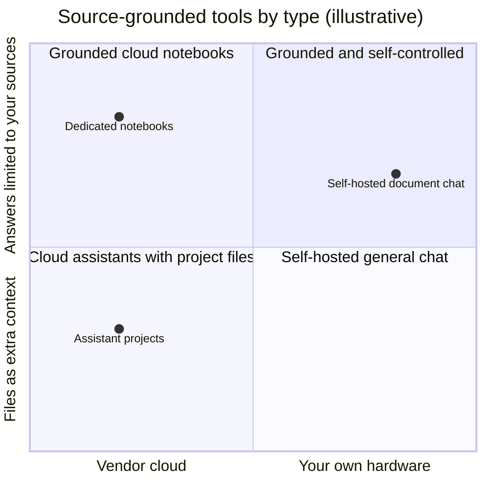
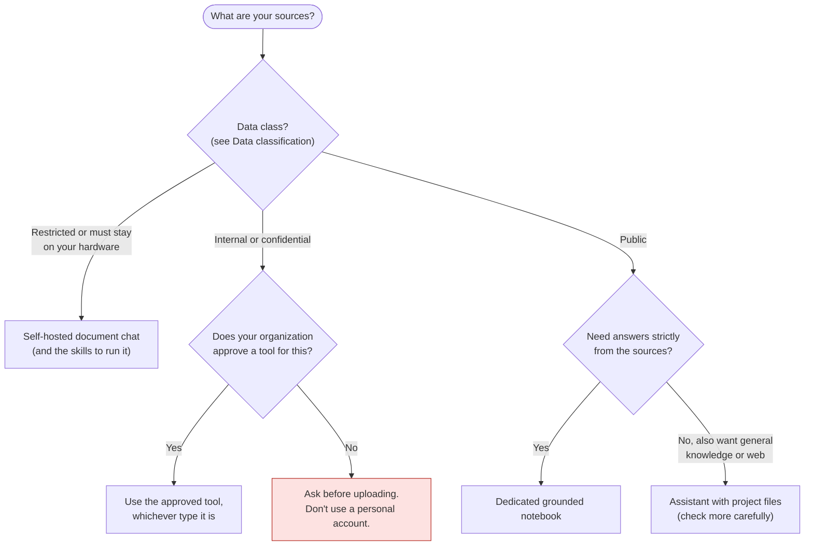

# Source-grounded synthesis tools: product landscape
{: .no_toc }

Tools for asking questions of documents you choose, so answers come from your sources rather than the model's general knowledge. This is rung 3 of the [learning ladder]().
{: .fs-6 .fw-300 }

{: .note }
**Last reviewed:** 2026-10-07. Products change often. Every entry below links to the vendor's official documentation or the project's official repository, and states only what that source said on the review date. Listing is not endorsement, and there is no ranking.

  
On this page

  {: .text-delta }
1. TOC
{:toc}

## What this category is

You add a set of sources (readings, reports, policies, transcripts) and ask questions. A well-grounded tool answers from those sources and shows *where* each answer came from, so you can check it. It's the tool type behind [Research-to-brief]() and the grounded options in [Software and infrastructure]().

Grounding reduces invented facts. It doesn't eliminate them, and it doesn't stop a tool from misreading a source. You still check the passages. See [How LLMs fail]().

## How to judge a tool in this category

| Question | Why it matters |
|:--|:--|
| **Are answers limited to your sources?** | Some tools answer only from what you add. Others use your files as extra context alongside general knowledge and web search, which is useful but harder to check. |
| **Does it cite specific passages?** | Passage-level citations make verification fast. |
| **What source types can you add?** | PDFs, documents, web pages, audio, video, connected drives |
| **Where does your data go?** | A cloud service under the vendor's terms, or your own computer or server |
| **Is there a free option?** | Many tools have one, with limits. Check the vendor's plans page. |
| **What account or license do you need?** | A personal account, an organization license, or nothing (self-hosted) |

The main trade-off in this category is between how strictly answers stick to your sources and how much control you have over where your data goes:

Positions are illustrative judgments about the *types* below, not measurements of individual products.

## Options

### Dedicated source-grounded notebooks (cloud)

| | Gemini Notebook (formerly NotebookLM) | Microsoft Copilot Notebooks |
|:--|:--|:--|
| **Vendor** | Google | Microsoft |
| **What it is** | Described by Google as an "AI-powered research assistant designed to help you refine and organize your ideas." | Described by Microsoft as an "AI-powered workspace designed for the content that matters most to your task." |
| **Limited to your sources?** | Designed to answer questions "based on the information provided in your uploaded sources." | Copilot "only uses the references you've added to the notebook to generate responses." |
| **Cites passages?** | Yes: "clear in-line citations." | Not confirmed in official docs. |
| **Source types** | PDFs, websites, YouTube videos, audio files, Google Docs, Google Slides | Files, meetings, emails, sites, and uploaded documents |
| **Free option?** | Yes. Usable without a paid plan, with standard usage limits. | Requires a Microsoft Copilot or Copilot Chat license, or certain Microsoft 365 consumer subscriptions. |
| **Data note** | Google states data "is not used to train Gemini Notebook unless you provide feedback." Workspace accounts have additional protections. | Microsoft links to its separate data, privacy, and security documentation. |
| **Official sources** | [Help center](https://support.google.com/notebooklm/answer/16164461) · [Usage limits](https://support.google.com/gemininotebook/answer/17670842) · [Rename announcement](https://blog.google/innovation-and-ai/products/gemini-notebook/notebooklm-gemini-notebook/) | [Get started](https://support.microsoft.com/en-us/microsoft-365-copilot/get-started-with-microsoft-365-copilot-notebooks) · [How it works](https://support.microsoft.com/en-us/microsoft-365-copilot/how-microsoft-365-copilot-notebooks-works) |
| **Checked** | 2026-10-07 | 2026-10-07 |

### General assistants with project files (cloud)

These aren't strictly grounded: your files add context, but answers can also draw on general knowledge and other tools. They're useful when you want both, and they need more careful checking.

| | ChatGPT Projects | Claude Projects |
|:--|:--|:--|
| **Vendor** | OpenAI | Anthropic |
| **What it is** | "Projects keep related chats, files, and instructions together." | "Self-contained workspaces with their own chat histories and knowledge bases." |
| **Limited to your sources?** | Not limited to your files: "ChatGPT can use what you add to provide more informed answers," and web search is available in projects. | Uploaded files are used as context. Not confirmed in official docs whether answers can be restricted to them. |
| **Cites passages?** | Not confirmed in official docs for project files. | Not confirmed in official docs. |
| **Source types** | PDFs, spreadsheets, docs, images, pasted text, and links from supported apps | Documents, text, code, and other files |
| **Free option?** | Yes. Projects are available to signed-in users, including the Free plan, with plan-based limits. | Yes. "Available to all users, including those with free Claude accounts," with a limit on the number of projects. |
| **Official sources** | [Projects in ChatGPT](https://help.openai.com/en/articles/10169521-projects-in-chatgpt) | [What are projects?](https://support.claude.com/en/articles/9517075-what-are-projects) |
| **Checked** | 2026-10-07 | 2026-10-07 |

### Self-hosted or local document chat (open-source)

These run on your own computer or server, with local models or a provider's API that you choose. See [Running AI]() for what that involves.

| | AnythingLLM | Open WebUI |
|:--|:--|:--|
| **Maintainer** | Mintplex Labs | Open WebUI project |
| **What it is** | Described as an "all-in-one AI application," with desktop apps for Mac, Windows, and Linux | Described as "a self-hosted AI platform that's extensible, feature-rich, user-friendly, and built to run entirely offline" |
| **Limited to your sources?** | Lets you chat with uploaded documents. Whether answers are restricted to them is not confirmed in official docs. | Includes "Local RAG Integration" over documents. Whether answers are restricted to them is not confirmed in official docs. |
| **Cites passages?** | Yes: "source citations" | Not confirmed in official docs. |
| **Source types** | Multiple document types, including PDF, TXT, and DOCX | Documents loaded into chats |
| **Models** | Works with local models (including via Ollama and llama.cpp-compatible models) and hosted providers | Works with Ollama and OpenAI-compatible APIs |
| **Free option?** | Yes, open-source | Yes, self-hosted |
| **License** | MIT | Open WebUI License, which includes a branding-preservation requirement. Read it before deploying. |
| **Official sources** | [GitHub repository](https://github.com/Mintplex-Labs/anything-llm) | [GitHub repository](https://github.com/open-webui/open-webui) |
| **Checked** | 2026-10-07 | 2026-10-07 |

## How to choose

Brand isn't one of the decision points. Data, approval, and how strictly you need answers grounded are.

## Try it: compare two options

1. Pick **three public sources** on one business question, such as three published reports on the same industry trend.
2. Add the same three to **two tools from different groups** above, for example one dedicated notebook and one assistant project.
3. Ask both: *"Where do these sources disagree? Quote the passages."*
4. **Verify** each answer: open every cited passage and check that it says what the tool claims. Note any claim with no passage.
5. Record the results in an [AI-use log](#ai-use-log): which tool stayed inside the sources, and which cited passages you could actually find.

The exercise is about the verification habit, not about picking a winner.

## Disclosure

The author has no paid, affiliate, or sponsorship relationship with any vendor or project listed on this page. This page was drafted with the help of an AI assistant made by Anthropic, one of the vendors listed. Each entry was checked against the official sources linked above, and every quoted phrase comes from those sources.

## Change log

| Date | Change |
|:--|:--|
| 2026-10-07 | Page created (pilot). Google renamed NotebookLM to Gemini Notebook on 2026-07-16 ([announcement](https://blog.google/innovation-and-ai/products/gemini-notebook/notebooklm-gemini-notebook/)). Listed under the new name, with the former name in brackets. |
