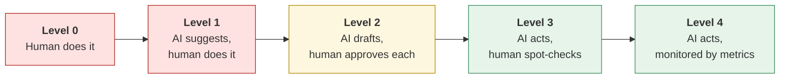
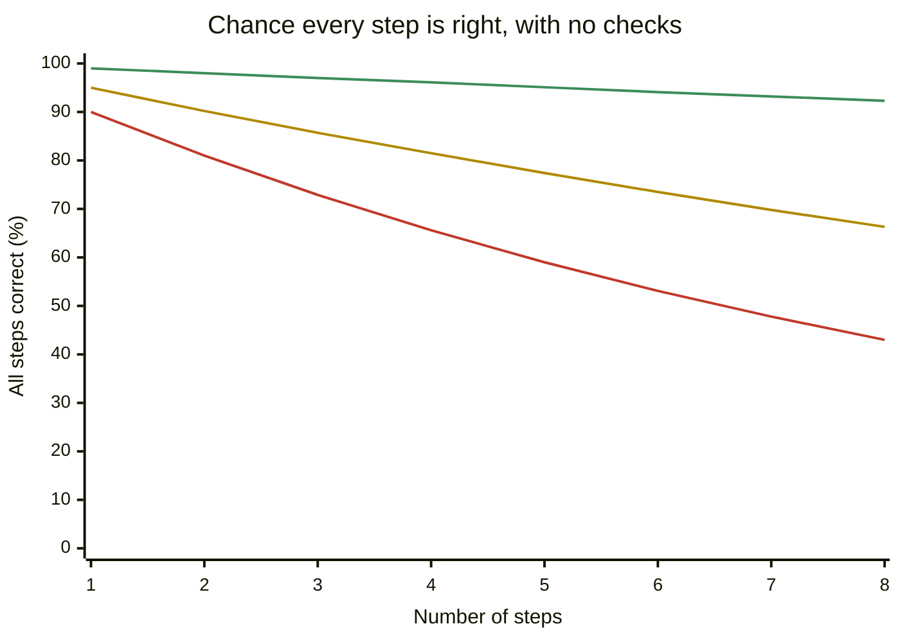
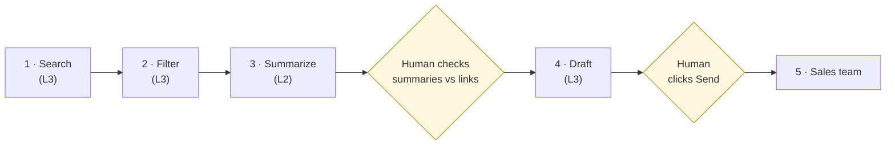

# Automate or judge?
{: .no_toc }

How much autonomy to give an agent at each step, building on [Should you use AI here?]().
{: .fs-6 .fw-300 }

<details open markdown="block">
  <summary>On this page</summary>
  {: .text-delta }
1. TOC
{:toc}
</details>

## Scenario

**Northwind Supply** (fictional) wants a weekly **competitor-news digest** for its sales team. An agent could search the news, filter for relevant items, summarize them, draft the digest, and send it, all on Monday mornings with no one involved.

The ops manager asks: *should it run fully on its own?* The answer isn't yes or no for the whole workflow. Each **step** gets its own answer.

## Why it matters

[Should you use AI here?]() helps you decide whether a *task* belongs with AI. Agents raise a finer question: within a multi-step workflow, how much should the agent do on its own at each step? That matters because:

- **Errors compound.** If each step is right 95% of the time, a 5-step chain with no checks is fully right only about 77% of the time.
- **Agents act.** They don't just draft. They can send, post, edit files, or spend money, and some actions can't be undone.
- **Accountability blurs** when no one has looked at an output before it goes out.

## AI-assisted approach

### Five levels of autonomy



Assign a level **per step** with four questions:

| Question | Pushes toward lower autonomy (0–2) | Pushes toward higher autonomy (3–4) |
|:--|:--|:--|
| Can the step's output be undone? | No (sent, published, paid) | Yes (internal draft, a list) |
| Who sees it? | Customers, clients, learners, the public | Only the team, or only the next step |
| How costly is an error? | Money, reputation, someone's rights or grade | A minor annoyance |
| Can you measure the error rate? | No | Yes, with sampling |

### Errors compound across steps



The lines show steps that are each 99% (green), 95% (amber), and 90% (red) accurate. At 90% per step, an 8-step chain is fully right less than half the time (0.90<sup>8</sup> ≈ 43%). A checkpoint in the middle resets the chain: errors caught at step 4 don't carry into steps 5–8.

### Northwind's digest, step by step

| Step | What the agent does | Level | Why |
|:--|:--|:--:|:--|
| 1. Search | Find news on 6 named competitors from the past week | 3 | Reversible, internal. Spot-check the source list monthly. |
| 2. Filter | Keep items relevant to sales conversations | 3 | Reversible. Sample what got filtered *out*. |
| 3. Summarize | Two-sentence summary per item, with a link | 2 | Summaries can distort sources (see [How LLMs fail]()). A person checks each against its link. |
| 4. Draft digest | Assemble the summaries into the team format | 3 | Formatting only, once step 3 is approved. |
| 5. Send to sales team | Email the digest | 2 | Sales reps may quote it to customers. A person clicks Send. |
| — | Post anything to customers or social media | 0 | Out of scope for the agent. Public and irreversible. |



The result: about 10 minutes of human time each Monday instead of an hour, with a person still accountable for what reaches the sales team.

### Give agents the least access they need

Autonomy also depends on what the agent is **allowed to touch**. The digest agent needs read access to the web and permission to draft an email. It doesn't need to send email without approval, edit the CRM, or read anyone's inbox. Give it only what the task requires, and keep a log of what it did.

## Prompt template

Use this to plan autonomy for any workflow before you build it:

```text
I'm planning an AI agent workflow for: [GOAL].
Steps: [LIST EACH STEP].

For each step, help me assess:
1. Can its output be undone? Who sees it?
2. What's the cost of an error at this step?
3. How could I measure the error rate?
4. Recommended autonomy level (0 = human does it, 1 = AI suggests,
   2 = AI drafts and human approves each, 3 = AI acts and human
   spot-checks, 4 = AI acts and is monitored by metrics), with reasoning.
5. The minimum tool access the agent needs for this step.

Then: where are the 1–2 most important human checkpoints, and what
should ALWAYS be escalated to a person?
```

Treat the AI's recommendations as a starting point. The autonomy decisions are yours.

## Verify checklist

- [ ] Every step has an assigned autonomy level and a reason.
- [ ] Every irreversible or external-facing step is level 2 or lower.
- [ ] There's a human checkpoint before errors can compound past the riskiest step.
- [ ] The agent has only the access each step needs.
- [ ] The agent's actions are logged, and someone reviews the log.
- [ ] Level 3–4 steps have a sampling or metric plan.
- [ ] There's a way to stop the agent quickly.
- [ ] A named person owns the workflow's outcomes.

## Common failure modes

| Failure | What it looks like | How to catch it |
|:--|:--|:--|
| **Whole-workflow thinking** | "It's mostly safe, so let it run" | Assign levels per step. |
| **Over-broad access** | An agent that only needed to draft can also send | Review permissions before launch. |
| **Autonomy creep** | Approval steps quietly skipped "because it's always fine" | Log approvals. Audit monthly. |
| **No off switch** | No one knows how to pause the scheduled agent | Document how to stop it, and test that it works. |
| **Compounding errors** | A bad search result becomes a confident summary, then a sales talking point | Put a checkpoint after the step where distortion happens. |
| **Silent failures** | The agent fails to find news one week and sends an empty or padded digest | Add a check: an unusually short or empty output goes to a human. |

## Disclose and decide notes

**Disclose:** Label agent-produced content for its readers. For example: *"Compiled by an AI agent from public news. Summaries reviewed by the ops team."*

**Decide:** Autonomy levels are business decisions. Revisit them when the stakes, the audience, the tool, or the measured error rate changes. Moving a step *up* a level should be a deliberate decision, not something that happens because nobody checked.

## For educators: turn this into a challenge

Give teams a 5–7 step workflow from your field, such as compiling a weekly course digest, screening vendor invoices, or drafting meeting minutes and sending action items. Teams assign an autonomy level and minimum access to each step, then present their checkpoint map. **Twist:** reveal that one step's output goes to an external audience, and see which teams change their design. See [Designing an AI-fluency challenge]().
