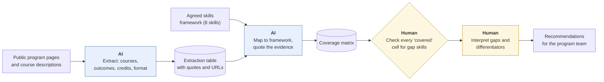
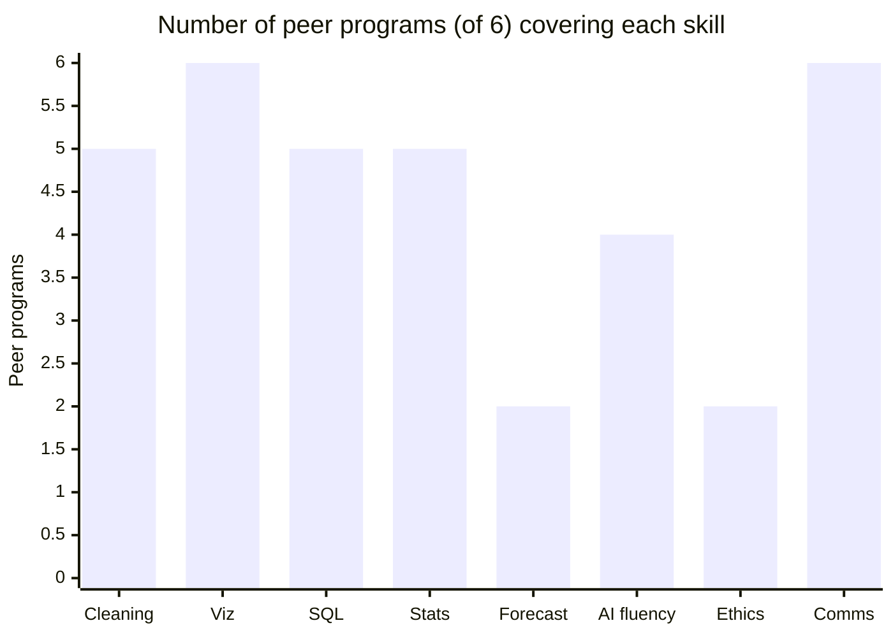

# Curriculum-benchmarking copilot
{: .no_toc }

A copilot pattern that compares public program and course descriptions against a skills framework, for a person to interpret.
{: .fs-6 .fw-300 }

<details open markdown="block">
  <summary>On this page</summary>
  {: .text-delta }
1. TOC
{:toc}
</details>

## Scenario

The program lead for a business-analytics certificate at **Westbrook College** (fictional) is preparing for a curriculum review. The question: *How does our certificate compare to six peer programs, and to the skills employers list for entry-level analyst roles?*

Done by hand, that means reading six programs' public web pages and course descriptions, building a spreadsheet, and mapping everything to an 8-skill framework the program team has agreed on. That's two or three days of careful, tedious work.

## Why it matters

Benchmarking informs real decisions: which courses to add, revise, or retire. AI is well suited to the tedious part, extracting structured information from many web pages. It's poorly suited to the interpretive part, deciding what a gap *means* for this program and its learners. It's also prone to a specific error in this task: **inferring coverage from course titles**. A course called "Analytics in the Age of AI" may not teach any AI tools at all.

## AI-assisted approach



1. **Fix the framework and the peer set first (Use).** The program team agrees on the 8 skills and the 6 peers *before* any AI work, so the AI doesn't define the comparison.
2. **Use only public information (Use).** Published program pages and course catalogs are Public data. Don't use pages behind logins, and follow the sites' terms. See [Data classification]().
3. **Extract with quotes (Use).** For every course, the AI records the title, the description, the learning outcomes, the URL, and the date the page was last updated, if shown.
4. **Map with evidence (Use).** A skill counts as "covered" only if a description or outcome *quotes* evidence of it. Titles alone don't count.
5. **Check the cells that matter (Verify).** Check every cell that would create or close a gap.
6. **Interpret (Decide).** A person decides what the gaps mean.

### The coverage matrix

After checking, the matrix looked like this (✓ = covered, with quoted evidence):

| Skill | Westbrook | P1 | P2 | P3 | P4 | P5 | P6 | Peers covering |
|:--|:--:|:--:|:--:|:--:|:--:|:--:|:--:|--:|
| Data cleaning | ✓ | ✓ | ✓ | ✓ | ✓ | | ✓ | 5 / 6 |
| Visualization | ✓ | ✓ | ✓ | ✓ | ✓ | ✓ | ✓ | 6 / 6 |
| SQL | | ✓ | ✓ | | ✓ | ✓ | ✓ | **5 / 6** |
| Statistics | ✓ | ✓ | ✓ | ✓ | | ✓ | ✓ | 5 / 6 |
| Forecasting | ✓ | | ✓ | | ✓ | | | 2 / 6 |
| AI tool fluency | | ✓ | | ✓ | ✓ | | ✓ | **4 / 6** |
| Ethics and governance | ✓ | | ✓ | | | ✓ | | 2 / 6 |
| Communication | ✓ | ✓ | ✓ | ✓ | ✓ | ✓ | ✓ | 6 / 6 |



**What the matrix suggests (for people to interpret):**

- **Possible gaps:** SQL (5 of 6 peers cover it; Westbrook doesn't) and AI tool fluency (4 of 6).
- **Possible differentiators:** forecasting and ethics and governance. Only 2 of 6 peers cover each, and Westbrook covers both.

**What checking found:** The AI's first matrix marked P4 and P5 as covering AI tool fluency. P4 has a quoted outcome to support it. P5's evidence was only a course *title*, so the cell was corrected and AI fluency dropped from 5 of 6 to 4 of 6. One SQL cell pointed to a catalog page from two years earlier, and the current page still listed the course, so it stayed. Overall, checking found **3 errors in 48 peer cells**, about 6%. Two of them were in skills that affect the gap analysis.

## Prompt template

**Extraction** (repeat per program)

```text
From the public page(s) below, extract every course in the program as a table:
Course code | Title | Description (verbatim) | Learning outcomes (verbatim)
| Credits | Format | URL | Page last-updated date (if shown).
Use only what's on the page. If a field isn't shown, write "not stated".
[PASTE PAGE TEXT OR URLS]
```

**Mapping**

```text
Here is our skills framework: [8 SKILLS WITH ONE-LINE DEFINITIONS].
Here is the extraction table for [PROGRAM]: [PASTE].

For each skill, mark COVERED only if a description or outcome explicitly
supports it, and QUOTE that text with its course code. Course titles alone
do NOT count. If evidence is partial or ambiguous, mark UNCLEAR and explain.
```

## Verify checklist

- [ ] The skills framework and peer set were agreed by people before any AI work.
- [ ] Only public pages were used, and the sites' terms were respected.
- [ ] Every "covered" cell has a quote from a description or outcome, not just a title.
- [ ] I checked every cell for the skills that come out as gaps or differentiators.
- [ ] I checked page dates and replaced outdated pages with current ones.
- [ ] UNCLEAR cells were resolved by a person.
- [ ] The report presents gaps as questions for the program team, not as conclusions.

## Common failure modes

| Failure | What it looks like | How to catch it |
|:--|:--|:--|
| **Coverage from titles** | "Analytics in the Age of AI" counted as AI tool fluency | Require quoted evidence from descriptions or outcomes. |
| **Outdated catalogs** | A course retired two years ago still counted | Record page dates, and check against the current catalog. |
| **Framework drift** | The AI quietly redefines a skill to fit what it found | Paste the definitions into every mapping prompt. |
| **Catalog vs. reality** | A description promises more than the course delivers | Treat catalog coverage as a claim. Talk to faculty before acting on it. |
| **Gap equals deficiency** | "Peers teach SQL, so we must add it" | Ask whether it fits *this* program's learners and goals. |
| **Naming peers publicly** | An internal comparison shared outside the team | Keep peer-specific analysis internal unless there's a reason to share it. |

## Disclose and decide notes

**Disclose:** In the review document: *"Course data was extracted from public program pages with an AI tool and mapped to our skills framework using quoted evidence. All cells affecting gap findings were checked by [NAME]."*

**Decide:** The matrix shows where programs differ. It doesn't say what Westbrook should do. Whether to add SQL, build up AI fluency, or lean into its ethics differentiator depends on learners, employers, faculty expertise, and mission. Those are the program team's decisions.

## For educators: turn this into a challenge

For a faculty development session: participants benchmark one of their own courses against two or three public course descriptions from other institutions, using the mapping prompt. Require quoted evidence for every cell. Debrief: *How many cells changed after you checked the evidence? Which gap surprised you, and do you agree it's a gap?* See [Designing an AI-fluency challenge]().
