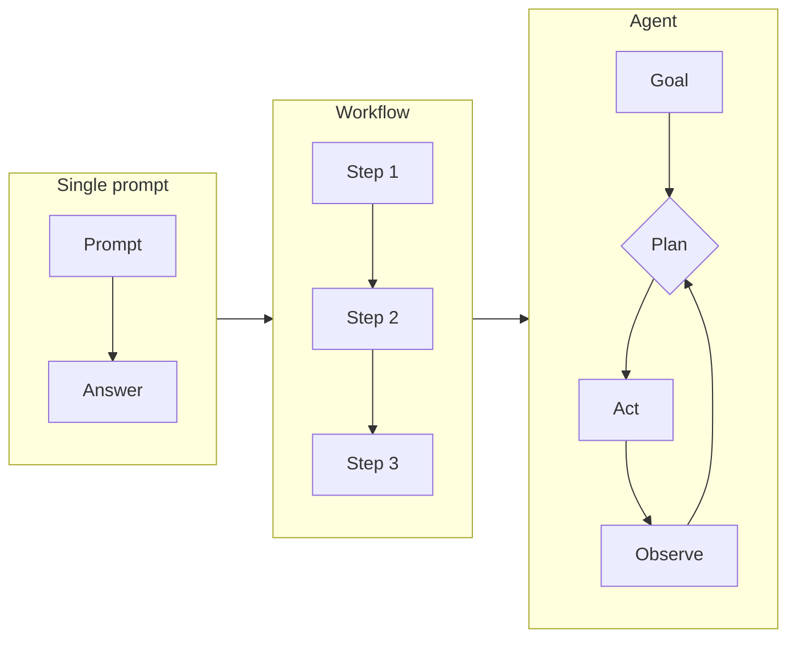

# Workflows & Agents

Simple patterns for chaining AI steps together, and for deciding where a human has to stay in the loop.
{: .fs-6 .fw-300 }

An **agent** is an AI setup that takes several steps toward a goal, such as searching, reading, drafting, and calling tools, without you prompting each step. Agents can save real time on multi-step work. They also compound errors: a mistake in step 1 carries through every step after it. The patterns here keep them simple and put human checkpoints where they count.

Before you build any workflow, read [Should you use AI here?](). Many "agent" ideas turn out to be plain automation, and a few turn out to be jobs that should stay with a person.
