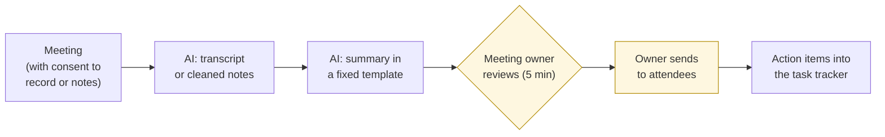
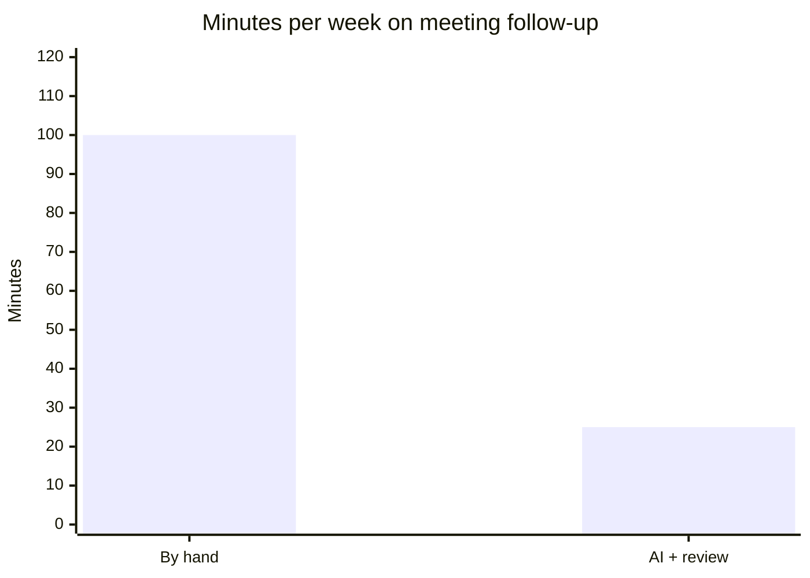

# Meeting-to-action-items workflow
{: .no_toc }

A simple, repeatable pattern for turning meeting recordings or notes into accurate summaries and owned action items, with the meeting owner as the checkpoint.
{: .fs-6 .fw-300 }

<details open markdown="block">
  <summary>On this page</summary>
  {: .text-delta }
1. TOC
{:toc}
</details>

## Scenario

A project lead at **Harborview Advisory** (fictional) runs five internal project meetings a week. Writing up notes and action items takes about **20 minutes per meeting**. Afterward, people still argue about who agreed to what. The team has an approved AI tool that can transcribe and summarize. The [first-principles review](#worked-example) of a similar feature already recommended keeping a person between the notes and the email. This page turns that recommendation into a working process.

## Why it matters

Meeting follow-up is one of the most common AI uses, and one of the easiest places for small errors to spread. A wrong owner, a discussed idea recorded as a decision, or a missed deadline goes out to everyone, and then into their task lists. A short, structured review by the meeting owner catches most of this.

## AI-assisted approach



1. **Get consent and check the data class (Use).** Tell attendees the meeting is being recorded or transcribed, and follow your organization's rules. Don't use AI tools for HR, legal, or confidential client meetings unless they're approved for that. See [Data classification]().
2. **Use a fixed template (Use).** The same sections every time make the review fast.
3. **Separate decisions from discussion (Use).** Ask the AI to label each item as a *decision*, a *discussion point*, or an *open question*.
4. **Review with three checks (Verify):** the owners, the decisions, and the dates.
5. **The owner sends it (Decide).** Never send action items automatically.

### The three checks

| Check | Look for | Typical AI error |
|:--|:--|:--|
| **Owners** | Is each action item assigned to the person who actually agreed to it? | Assigning the task to whoever spoke about it |
| **Decisions** | Was this actually decided, or only discussed? | Recording "we could try X" as "decided: X" |
| **Dates** | Are deadlines what was agreed, in the right format? | Inventing a deadline, or misreading "next Friday" |

### Is it worth it?

| | Per meeting | Per week (5 meetings) |
|:--|--:|--:|
| Writing notes by hand | 20 min | 100 min |
| AI draft + owner review | 5 min | 25 min |
| **Saved** | 15 min | **75 min** |



The review time is what keeps the saving honest. Skip it, and you trade 75 minutes for a steady trickle of wrong action items.

## Prompt template

```text
From this [TRANSCRIPT / NOTES] of a [MEETING TYPE] on [DATE], with
attendees [NAMES AND ROLES], produce:

1. Summary (3–5 bullets).
2. Decisions — only items explicitly agreed. Quote or closely paraphrase
   the moment of agreement.
3. Action items — table: Action | Owner | Due date | Evidence (who agreed,
   with a short quote). If owner or date wasn't stated, write "UNCLEAR".
4. Open questions — things discussed but not decided.

Don't infer owners or deadlines. Don't turn suggestions into decisions.
```

The "UNCLEAR" rule matters. It turns a guess into a visible question for the meeting owner.

## Verify checklist

- [ ] Attendees knew the meeting was being recorded or transcribed, and the meeting type is allowed in this tool.
- [ ] Every action item has an owner who actually agreed to it.
- [ ] Every "decision" was explicitly agreed, not just discussed.
- [ ] Every due date matches what was said.
- [ ] All UNCLEAR items were resolved, or sent as questions.
- [ ] The meeting owner reviewed and sent the summary. Nothing was sent automatically.
- [ ] Recordings and transcripts follow the retention rules.

## Common failure modes

| Failure | What it looks like | How to catch it |
|:--|:--|:--|
| **Wrong owner** | "Sam to draft the proposal," when Sam only raised the idea | Require evidence of agreement for each owner. |
| **Discussion as decision** | "Decided: move launch to May," when it was only floated | Separate decisions from discussion in the template. |
| **Invented deadlines** | "Due Friday" when no date was set | Require "UNCLEAR" instead of guessing. |
| **Auto-sending** | Wrong items emailed to 12 people before anyone checks | Turn off auto-send. The owner sends. |
| **Recording without consent** | Attendees unaware they were transcribed | Announce it at the start, and follow policy. |
| **Confidential meetings** | Sensitive HR or client discussions in an unapproved tool | Check the data class before recording. |

## Disclose and decide notes

**Disclose:** Add a line to the summary: *"AI-drafted from the meeting transcript; reviewed by [OWNER]. Reply with corrections."* The invitation to correct matters, since attendees are the best check on their own commitments.

**Decide:** What was decided in the meeting is a matter for the people who were there. The AI's summary is a draft record. The meeting owner's sent version is the official one.

## For educators: turn this into a challenge

Record (with consent) or script a 10-minute mock project meeting with three deliberate ambiguities: an idea that's floated but not agreed, a task without a clear owner, and a vague deadline. Learners use AI to produce the summary with the prompt above, then run the three checks. Debrief: *Did the AI resolve the ambiguities by guessing? Did the UNCLEAR rule help?* See [Designing an AI-fluency challenge]().
