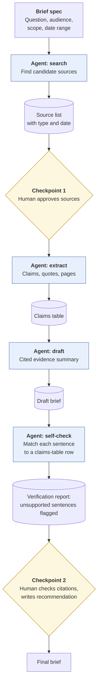
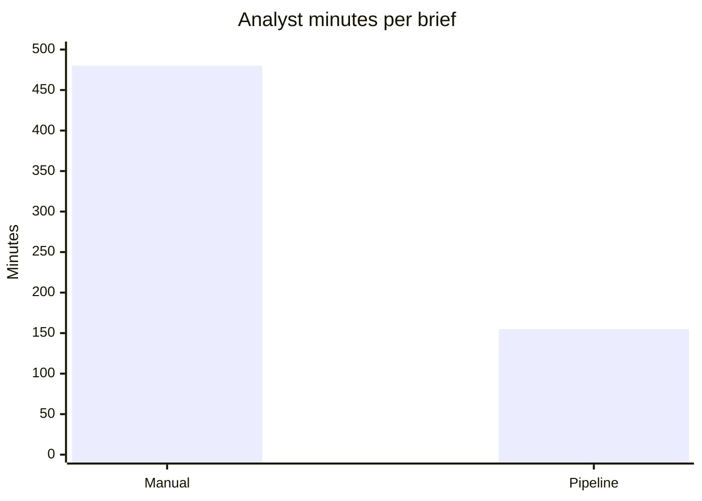

# Research-to-brief pipeline
{: .no_toc }

A simple multi-step agent pattern that gathers sources, extracts claims, and drafts a cited brief, with human checkpoints where they count.
{: .fs-6 .fw-300 }

<details open markdown="block">
  <summary>On this page</summary>
  {: .text-delta }
1. TOC
{:toc}
</details>

## Scenario

A three-person strategy team at **Harborview Advisory** (a fictional consultancy) writes about four short research briefs a month for clients, on questions like *"What's changed in last-mile delivery pricing this year?"* Each brief takes an analyst about a day. The team has already learned the manual method from [Research-to-brief](). Now they want to turn it into a repeatable pipeline that an agent mostly runs, without losing the verification that makes their briefs trustworthy.

## Why it matters

The manual research-to-brief method works, but it's slow, and steps get skipped when deadlines are tight. A pipeline makes the method **repeatable**: the same steps, the same intermediate outputs, and the same checks, every time. The risk is that an agent chains steps together so smoothly that a bad source in step 1 turns into a confident claim in the final brief with no one noticing. The design goal is to automate the reading and keep the judging human.

## AI-assisted approach

### The pipeline

Each step produces a **saved intermediate output** that the next step uses and a person can inspect.



### Why these two checkpoints

- **Checkpoint 1, sources:** A bad source poisons every later step, and catching it here is cheap: you're scanning a list, not reading a brief. The reviewer removes advocacy-only, outdated, or off-topic sources and can add ones the agent missed.
- **Checkpoint 2, citations and the recommendation:** This is the last point before the client sees the brief. The agent's self-check is useful triage because it flags sentences without a matching claim. It isn't verification. A person still opens the source behind every citation. See [How LLMs fail]().

The extraction and drafting steps run at autonomy level 3 (AI acts, human spot-checks), and both checkpoints are at level 2 (human approves). See [Automate or judge?]().

### Time, before and after

| Step | Manual (minutes) | Pipeline: human time (minutes) |
|:--|--:|--:|
| Find and screen sources | 90 | 20 (approve the list) |
| Read and extract claims | 180 | 30 (spot-check the claims table) |
| Draft evidence summary | 120 | 0 (agent) |
| Check citations | 45 | 60 (every citation, guided by the verification report) |
| Recommendation | 45 | 45 |
| **Total** | **480** | **155** |



That's 325 minutes saved per brief (about 68%). Citation checking takes *longer* in the pipeline, which is intentional. The time saved on reading goes partly into checking.

## Prompt template

Write the pipeline down as a **spec** that the agent, or a teammate, can follow. Many tools can save this as a reusable project, template, or skill (see [Tools]()).

```text
RESEARCH-TO-BRIEF PIPELINE

Brief spec: question = [QUESTION]; audience = [AUDIENCE];
date range = [RANGE]; length = [LENGTH]; exclude = [SOURCE TYPES TO AVOID].

Step 1 — Search. Find 8–12 candidate sources. Output a table:
ID | title | publisher | date | type (peer-reviewed / industry / news /
advocacy / company) | URL | one-line relevance note.
STOP and wait for my approval of the source list.

Step 2 — Extract. From approved sources only, build a claims table:
claim | source ID | verbatim quote | page/section | caveats | population.

Step 3 — Draft. Using only the claims table, write the evidence summary:
bottom line, agreement, disagreement, fit to our context, open questions.
Inline citations [ID, page] on every factual sentence. No recommendation.

Step 4 — Self-check. For every sentence in the draft, name the claims-table
row that supports it. List any sentence with no matching row as UNSUPPORTED.
STOP and give me the draft plus this report.
```

The **STOP** lines are the checkpoints. Keep them even when you're in a hurry.

## Verify checklist

- [ ] The brief spec is written down before the agent runs.
- [ ] A person approved the source list, including source types and dates.
- [ ] The claims table was spot-checked: at least 5 quotes found on the stated pages.
- [ ] Every UNSUPPORTED sentence in the verification report was fixed or cut.
- [ ] A person opened the source for **every** citation in the final brief.
- [ ] The recommendation was written by a person and is marked as such.
- [ ] Intermediate outputs (source list, claims table, report) are saved alongside the brief.

## Common failure modes

| Failure | What it looks like | How to catch it |
|:--|:--|:--|
| **Skipping checkpoint 1** | The agent runs end to end, and an advocacy blog becomes a key source | Keep the STOP instruction. Don't proceed without approval. |
| **Trusting the self-check** | "The report shows no unsupported sentences, so we're done" | The self-check uses the same model. A person still opens every citation. |
| **Agent searching beyond scope** | Sources from outside the date range or region | Put scope in the spec, and check source dates at checkpoint 1. |
| **Lost intermediate outputs** | Only the final brief is saved, so errors can't be traced | Save every intermediate output with the brief. |
| **Template drift** | Different analysts quietly edit the spec | Keep one versioned spec, and review changes together. |
| **Overloaded checkpoint 2** | A reviewer facing 40 citations at 6 p.m. | Schedule review time, and split citation checks between two people if needed. |

## Disclose and decide notes

**Disclose:** For example, at the end of each brief: *"Sources gathered and claims extracted by an AI pipeline. Source list approved and all citations verified by [ANALYST]. Recommendation by [ANALYST]."*

**Decide:** The pipeline produces evidence. The analyst produces advice. Keep them visibly separate, so the client knows which part is judgment.

## For educators: turn this into a challenge

Have teams turn the manual [Research-to-brief]() method into a written pipeline spec, then run it on a question you provide. Grade the **spec and the checkpoints** as much as the brief. **Twist:** include one off-topic or outdated source in the search results. Did it survive checkpoint 1? See [Designing an AI-fluency challenge]().
