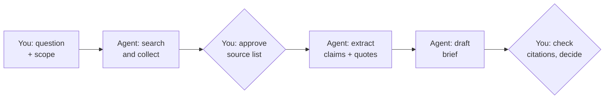

# Research-to-brief pipeline
{: .no_toc }

A simple multi-step agent pattern that gathers sources, extracts claims, and drafts a cited brief, with human checkpoints.
{: .fs-6 .fw-300 }

{: .stub }
This page is a stub. It follows the [page template](https://github.com/clarkngo/applied-ai-field-guide/tree/main/docs/_templates) and will be filled in soon.

  
On this page

  {: .text-delta }
1. TOC
{:toc}

## Scenario

<!-- TODO -->

## Why it matters

<!-- TODO -->

## AI-assisted approach

<!-- TODO -->

## Prompt template

<!-- TODO -->

## Verify checklist

<!-- TODO -->

## Common failure modes

<!-- TODO -->

## Disclose and decide notes

<!-- TODO -->

## For educators: turn this into a challenge

<!-- TODO -->
