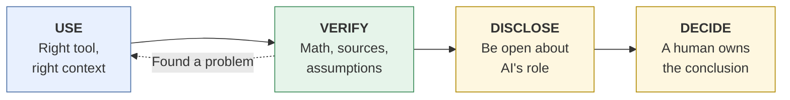

# Applied AI Field Guide
{: .fs-9 }

Judgment over prompts: using AI in real business and teaching work.
{: .fs-6 .fw-300 }

[New to AI? Start with the quick start](){: .btn .btn-primary .mr-2 }
[Read the rubric](){: .btn }

---

Most AI advice is about prompts. This guide is about **judgment**: knowing which tool to use, what context to give it, how to check what comes back, how to be open about AI's role, and when the decision has to stay with you. Every page is built around a real task, such as a break-even analysis, a market scan, or a course announcement. Each one walks through an AI-assisted approach, a verification checklist, and the ways things commonly go wrong. The examples use fictional companies and worked numbers you can check yourself.

## Who this is for

**Business students** (undergraduate, MBA, EMBA) who want to use AI in business tasks without handing over their thinking. Start with [For Students]().

**Business educators** (faculty, instructional designers, corporate trainers) who design AI-fluency activities or use AI in course operations. Start with [For Educators]().

## The rubric: Use · Verify · Disclose · Decide

Every task page in this guide is organized around four habits.

| | Habit | What it means |
|:--|:--|:--|
| 1 | **Use** | Pick the right tool and give it the right context. |
| 2 | **Verify** | Check the math, the sources, and the assumptions. Look for hallucinations. |
| 3 | **Disclose** | Be transparent about AI's role, following your course or company policy. |
| 4 | **Decide** | A human owns the conclusion and is accountable for it. |

The [full rubric]() describes what beginning, developing, and proficient work looks like for each habit. The habits come from ten [first principles]() about how AI works.

## How the guide is organized

- **[Start Here]()**: what AI is, first, second, and third principles, whether to use it, the rubric, and a glossary.
- **[Foundations]()**: context engineering, how LLMs fail, data classification, human-in-the-loop design, bias and ethics.
- **[For Students]()**: worked business tasks.
- **[For Educators]()**: challenge design, a Socratic tutor prompt, knowledge checks, course operations, course AI policies, AI-resilient assessment.
- **[Workflows & Agents]()**: simple multi-step patterns, and when to automate.
- **[Tools]()**: a vendor-neutral learning ladder, and how to evaluate a tool.
- **[Templates]()**: every copy-paste template and rubric in one place.

---

This guide is an independent professional reference by [Clark Ngo](https://clarkngo.github.io/). It is not affiliated with or endorsed by any university or employer.
